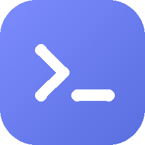
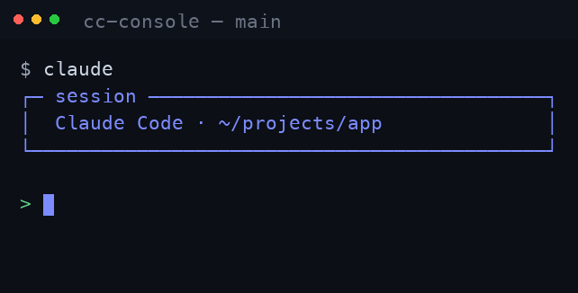

<div align="center">



# cc-console

### 把你终端里的 AI 编程 agent，实时装进手机。

cc-console 把你电脑终端里正在跑的 **Claude Code / Codex / Gemini** 会话，实时镜像到手机、平板或任意浏览器。随时查看、一键接管、在任何地方回它的 Yes/No —— 会话永不掉线。

[**🌐 官网**](https://cc.cchub.cloud) · [**⬇️ 下载**](https://cc.cchub.cloud/#download) · [**🔑 登录**](https://app.cchub.cloud) · [**🇬🇧 English**](README.md)


[](https://github.com/cc-console/releases/releases)
[](https://github.com/cc-console/cchub-cloud)

<br/>



</div>

---

## 为什么用 cc-console

你的 agent 跑在桌面电脑上，但你不可能一整天守在屏幕前。cc-console 把它们正在进行的会话带到你身边 —— **而且代码和密钥不经过任何第三方服务器。**

- ⚡ **实时镜像** —— 和桌面完全同步的同一个终端。
- 📱 **手机随时接管** —— 通勤路上、沙发上,用手机就能回它的确认。
- 🧠 **多 agent 并行** —— Claude、Codex、Gemini 并排显示,各有配色。
- 🔔 **主动提醒** —— agent 停下来等你拍板 Yes/No 时主动通知你(声音 + 推送 + 标签角标)。一键 **Autopilot** 可自动确认,让长任务自己跑完。
- 📊 **用量与花费** —— 每个会话的实时 token 计量,以及聚合统计。
- 🔒 **本地优先 · 私密** —— 默认只在本机回环;远程走你自己的端到端隧道 + token 鉴权。无需开放端口,也不需要公网 IP。

## 安装

> macOS/Linux 需要 `tmux`,以及你要用的 agent CLI(`claude` / `codex` / `gemini`)在 `PATH` 里。远程访问还需要 `cloudflared`。

### 1. macOS(Apple Silicon,M1–M5)
**步骤一 —— 下载**安装包:**[cc.cchub.cloud/#download](https://cc.cchub.cloud/#download)**,把 **cc-console** 拖进「应用程序」。

**步骤二 —— 首次打开,解除签名拦截。** 为控制开发成本,App 暂未购买 Apple 签名,macOS 会拦下并提示「已损坏」。第一次打开请在「终端」里运行下面这行命令一次,之后正常双击打开即可:
```bash
xattr -dr com.apple.quarantine /Applications/cc-console.app
```

**步骤三 —— 装依赖。** `tmux` 必装(运行会话所需);`cloudflared` 仅手机/远程访问需要:
```bash
brew install tmux cloudflared
```
另外把你要用的 CLI(`claude` / `codex` / `gemini`)装好并保持在 `PATH` 里。

### 2. Windows
**步骤一 —— 下载** **[.exe 安装程序](https://cc.cchub.cloud/#download)**。

**步骤二 —— 双击安装**(如遇不安全提示,点「更多信息 → 仍要运行」)。Windows 自带会话引擎 —— 无需 tmux。

**步骤三 —— 从开始菜单**打开 cc-console。

### 3. Ubuntu —— 桌面系统
**步骤一 —— 下载 [.deb](https://cc.cchub.cloud/#download)** 安装包并双击完成安装(或 `sudo dpkg -i cc-console-linux-x64.deb`)。

**步骤二 —— 装依赖 tmux**(运行会话所需):
```bash
sudo apt install -y tmux
```

**步骤三 —— 装隧道工具 cloudflared**(仅远程访问需要;也可以本地从 GitHub 下载再上传到机器):
```bash
sudo curl -fL --progress-bar \
  https://github.com/cloudflare/cloudflared/releases/latest/download/cloudflared-linux-amd64 \
  -o /usr/local/bin/cloudflared
sudo chmod +x /usr/local/bin/cloudflared
cloudflared --version
```

**步骤四 —— 从应用菜单打开** cc-console。并确保你要用的 CLI(`claude` / `codex` / `gemini`)在 `PATH` 里。

### 4. 服务器(Ubuntu,无界面)
> 前置:服务器已能正常跑通 `claude` / `codex` / `gemini`(接口不通时先配好代理)。

**步骤一 —— 装依赖 tmux:**
```bash
sudo apt install -y tmux
```

**步骤二 —— 装隧道工具 cloudflared**(也可本地从 GitHub 下载再上传):
```bash
sudo curl -fL --progress-bar \
  https://github.com/cloudflare/cloudflared/releases/latest/download/cloudflared-linux-amd64 \
  -o /usr/local/bin/cloudflared
sudo chmod +x /usr/local/bin/cloudflared
cloudflared --version
```

**步骤三 —— 安装 cc-console 并加入 PATH:**
```bash
curl -fsSL https://github.com/cc-console/releases/releases/latest/download/install.sh | sh
export PATH="$HOME/.local/bin:$PATH"
```

**步骤四 —— 绑定私人设备码。** 到 **[app.cchub.cloud/account](https://app.cchub.cloud/account)** 注册登录 → 设一个属于自己的用户名(决定你的地址 `用户名.cchub.cloud`)→ 点「生成设备码」拿到 `ccd_…` 并复制,然后在服务器终端粘入:
```bash
cc-console link        # 粘入 ccd_… 设备码,完成设备绑定
```

**步骤五 —— 启动。** 输入 `cc-console` 正式开启工具,随后会生成一个 `https://用户名.cchub.cloud/?token=…` 的网址:
```bash
cc-console
```

**步骤六 —— 其他设备登录。** 在手机/浏览器打开上面的 `https://用户名.cchub.cloud/?token=…` 网址,即可实时控制服务器上的 claude / codex / gemini。

**后台常驻**(断开 SSH 也不掉;nohup —— 容器无 systemd 也能用):
```bash
export PATH="$HOME/.local/bin:$PATH"
nohup cc-console > ~/cc-console.log 2>&1 &
disown
```
- 看日志 / 地址:`tail -f ~/cc-console.log`  ·  是否在跑:`pgrep -af cc-console`
- 停止:`pkill -f cc-console`  ·  重启:`pkill -f cc-console; sleep 1; nohup cc-console > ~/cc-console.log 2>&1 & disown`

## 工作原理

```
  你的电脑                            Cloudflare 边缘             你,在任何地方
┌─────────────────────┐                                       ┌───────────────┐
│ claude / codex /     │   cc-console 守护进程                  │  手机 /       │
│ gemini  (tmux/pty)   │──►  (Rust,本地)   ──► 加密     ───► │  浏览器       │
│                      │     WebSocket 桥接     隧道           │  同一个会话   │
└─────────────────────┘                                       └───────────────┘
```
守护进程完全跑在你自己的机器上。远程访问是**可选**的 Cloudflare 隧道,且强制 token 鉴权 —— 你的代码和 API 密钥永远不碰我们的服务器。托管选项还能给你一个零配置、稳定的 `你的名字.cchub.cloud` 地址。

## 链接

- **官网 / 下载:** https://cc.cchub.cloud
- **账号 / 登录:** https://app.cchub.cloud
- **所有版本:** https://github.com/cc-console/releases/releases

---

<div align="center">

🇬🇧 English: **[README.md](README.md)**.

觉得有用的话,点个 ⭐ Star 支持一下。

**[⬇️ 下载](https://cc.cchub.cloud/#download)** · **[🌐 cc.cchub.cloud](https://cc.cchub.cloud)**

</div>
